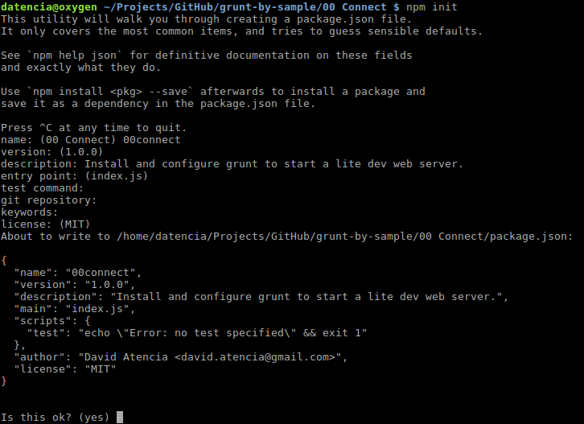
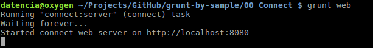
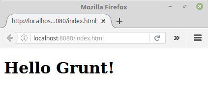
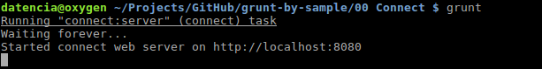

# 00 Connect

In this sample we are going to create a simple HTML page, then install all the grunt plumbing up and running and configure grunt
to start a lite dev web server the HTML page.

Summary steps:

- Initialize a package.json file.
- Create a simple HTML file.
- Install grunt-cli globally.
- Install a grunt plugin to fire a lite web server (connect).
- Configure an empty grunt config file.
- Define the dev web server task.
- Run the dev web server.
- Setup the dev web server as the default task.

# Steps to build it

## Prerequisites

Install [Node.js and npm](https://nodejs.org/en/) if they are not already installed on your computer.

> Verify that you are running at least node v6.x.x and npm 3.x.x by running `node -v` and `npm -v` in a terminal/console window. Older versions may produce errors.

## Steps

- Navigate to the folder where you are going to create the empty project.

- Execute `npm init`, you will be prompted to answer some information request
about the project (once you have successfully fullfilled them a `package.json`
file we will generated).

 ```bash
 $ npm init
 ```

 

 > Fullfill the requested info (do not forget, project name should not contain white spaces and must be lowercase, most of the info can be fullfilled with default values just by pressing enter).

- Create a subfolder called `src`, then create a file called `index.html` under
 this folder with the following content.

 ```html
 <!DOCTYPE html>
 <html>
   <head>
     <meta charset="utf-8">
     <title></title>
   </head>
   <body>
     <h1>Hello Grunt!</h1>
   </body>
 </html>
 ```

- Install `grunt-cli` globally with the next command from the command prompt.

 ```bash
 $ npm install -g grunt-cli
 ```

- Install now `grunt` locally and save it as a dev dependency.

 ```bash
 $ npm install grunt --save-dev
 ```

 > More info about this initial setup: [Grunt getting started](http://gruntjs.com/getting-started).

- Now we are going to install `grunt-contrib-connect`, a Grunt plugin that
is able to start a lite dev web server (we will save it into our `package.json`
as a dev dependency).

 ```bash
 $ npm install grunt-contrib-connect --save-dev
 ```

- Create an empty file called `gruntfile.js`, this is the Grunt config file and
 is used to configure or define tasks and load Grunt plugins.

- By now you should end up with the following folder tree structure:

 ```
 .
 ├── gruntfile.js
 ├── package.json
 └── src
     └── index.html
 ```

- Add the next content to the `gruntfile.js`.

 ```javascript
 module.exports = function(grunt) {

   grunt.initConfig({
   });

 };
 ```

- Define the dev web server launch task:

    - (I) load the plugin.

    ```javascript
    module.exports = function(grunt) {

      grunt.loadNpmTasks('grunt-contrib-connect');

      grunt.initConfig({
      });

    };
    ```
    - (II) Configure the task.

    ```javascript
    module.exports = function(grunt) {

      grunt.loadNpmTasks('grunt-contrib-connect');

      grunt.initConfig({
        connect: {
          server: {
            options: {
              hostname: 'localhost',
              port: 8080,
              keepalive:true,
              base: 'src',
              directory: 'src',
              open: {
                target: 'http://localhost:8080/index.html'
              }
            }
          }
        }
      });

    };
    ```

    - (III) Register the task and give it a name to be able to launch it form the command prompt.

    ```javascript
    module.exports = function(grunt) {

      grunt.loadNpmTasks('grunt-contrib-connect');

      grunt.initConfig({
        connect: {
          server: {
            options: {
              hostname: 'localhost',
              port: 8080,
              keepalive:true,
              base: 'src',
              directory: 'src',
              open: {
                target: 'http://localhost:8080/index.html'
              }
            }
          }
        }
      });

      grunt.registerTask('web', ['connect']);

    };
    ```

- It's time to check the work done, run the dev web server with the
following command from the command prompt.

 ```bash
 $ grunt web
 ```

 

- This task will open http://localhost:8080/index.html in your default browser automatically.

 

- Since this is something we are going to use quite often, we can set it up as
 a default task (open gruntfile.js and add the default task).

  ```javascript
  module.exports = function(grunt) {

    grunt.loadNpmTasks('grunt-contrib-connect');

    grunt.initConfig({
      connect: {
        server: {
          options: {
            hostname: 'localhost',
            port: 8080,
            keepalive:true,
            base: 'src',
            directory: 'src',
            open: {
              target: 'http://localhost:8080/index.html'
            }
          }
        }
      }
    });

    grunt.registerTask('web', ['connect']);
    grunt.registerTask('default', ['web']);

  };
  ```

- We can now just run `grunt` from the command prompt to lauch the dev server, with no
extra params.

 ```bash
 $ grunt
 ```

 
