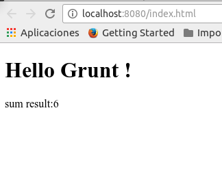

# 01 Dist

In this sample we are going to create a distribution folder where we are going
to place the result of the grunt build folder, then we are going to configure our
dev server to point to that distribution folder.

Summary steps:

- Create a _dist_ folder.
- Install and configure a clean plugin for grunt: [_grunt-contrib-clean_](https://github.com/gruntjs/grunt-contrib-clean).
- Install and configure a copy plugin for grunt: [_grunt-contrib-copy_](https://github.com/gruntjs/grunt-contrib-copy).
- Create task called _build-dev_ that will make use of the two plugins to copy the html to dist, this task:
    - Will first clean the _dist_ folder content using the cleaning plugin.
    - Then will copy all the needed files to that folder.
- Change where connect is pointing and configure root as _dist_.
- Create a simple js file called _calculator.js_ add a simple sum function.
- Create a simple js file called _main.js_ this file will make use of sum function.
- Reference both files in the HTML via _script_ tags.
- Extend the copy task to copy as well the js files.
- Test that everything is working as expected.

# Steps to build it

##Prerequisites

This sample takes as starting point _00 Connect_.

##Steps

- The first step is to create a _dist_ folder under the project root:

```
.
├─ dist
├─ src
│  └─ main.html
├─ gruntfile.js
└─ package.json
```

- Then let's install and configure _grunt-contrib-clean_ to clean folders and _grunt_contrib_copy_ to copy files.

  ```
  npm install grunt-contrib-clean grunt-contrib-copy --save-dev
  ```
  - (I) Let's add the config for the plugin:


```diff
  grunt.initConfig({
    connect: {
      server: {
        options: {
          hostname: 'localhost',
          port: 8080,
          keepalive: true,
          base: 'src',
          directory: 'src',
          open: {
            target: 'http://localhost:8080/index.html'
          }
        }
      }
-    },
+    },
+    clean: ['dist']
  });
```

- (II) We also need to load the grunt plugin:

```diff
module.exports = function (grunt) {
  grunt.loadNpmTasks('grunt-contrib-connect');
+ grunt.loadNpmTasks('grunt-contrib-clean');
```

- The next step is to install and configure _grunt-contrib-copy_ to copy our built files from _src_ to  _dist_ folder.

```bash
npm install grunt-contrib-copy --save-dev
```
- (I) Let's add the config for the copy plugin:

```diff
    },
    clean: ['dist'],
+    copy: {
+      main: {
+        files: [
+          {
+            expand: true,
+            cwd: './src/',
+            src: ['*.js'],
+            dest: './dist'
+          },
+          {
+            src: './src/index.html',
+            dest: './dist/index.html'
+          }
+        ]
+      }
+    }
  });
```

- (II) We also need to tell grunt to load this plugin:

```diff
grunt.loadNpmTasks('grunt-contrib-connect');
grunt.loadNpmTasks('grunt-contrib-clean');
+  grunt.loadNpmTasks('grunt-contrib-copy');
```

- Once we have the two plugins in our _gruntfile.js_ let's define a _build-dev_ task that will sequentially execute clean and then copy:

```diff
grunt.registerTask('web', ['connect']);
+ grunt.registerTask('build-dev', ['clean', 'copy']);
```

- It's time to update where our dev server is pointing. Let's change it to _dist_.

```diff
  grunt.initConfig({
    connect: {
      server: {
        options: {
          hostname: 'localhost',
          port: 8080,
          keepalive: true,
+          base: 'dist',
+          directory: 'dist',          
-          base: 'src',
-          directory: 'src',
          open: {
            target: 'http://localhost:8080/index.html'
          }
        }
      }
    },
```

- Let's add a new command to our _package.json_

```diff
"scripts": {
  "start": "grunt web",
+ "build": "grunt build-dev"  
  "test": "echo \"Error: no test specified\" && exit 1"
},
```

- Let's try both commands:

```bash
npm run build
```

```bash
npm start
```

- It's time to play with some javascript, let's add a simple _calculator.js_ file under _src_:

```javascript
function mySum(a, b) {
  return a + b;   
}
```

 - Now let's add an _main.js_ file that will make use of the previously created filed (_calculator_):

 ```javascript
 var result = mySum(2, 4);
 document.write(" sum result:" + result);
 ```

 - Let's reference both files in the main HTML:

```html
...
    <h1>Hello Grunt !</h1>
    <script src="./calculator.js"></script>
    <script src="./main.js"></script>
  </body>
</html>
```

- Finally it's time to test that everything is working as expected.
  - (I) Execute the `build-dev` task we've created.

  ```
  npm run build
  ```

  - (II) Launch the `web` task to see the result.

  ```
  npm start
  ```

  You should end up seeing something like the figure below:

  
