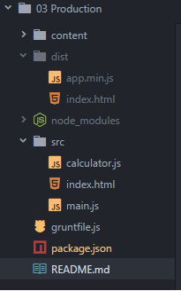
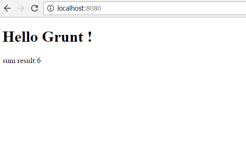

# 02 Prod

This sample takes as starting point _01 Dist_.

In this sample we are going to create a production ready package, we will
concatenate all js in a single bundle file, then minify it and update then
script references on the generated index.html

Summary steps:

- Let's install a file concat plugin
- Let's install an uglify  plugin.
- Let's configure our concat / uglify plugins in gruntfile.js.
- Let's refactor our copy plugin.
- Let's install a process html plugin.
- Let's check that all is running smoothly.

# Steps to build it

## Prerequisites

Same as on _00 Connect_ sample.

## Steps

- Let's install a file concat plugin.
```
npm install grunt-contrib-concat --save-dev
```

- Let's install a uglify plugin.
```
npm install grunt-contrib-uglify --save-dev
```

- Let's require this plugins on our _gruntfile.js_
```javascript
grunt.loadNpmTasks('grunt-contrib-concat');
grunt.loadNpmTasks('grunt-contrib-uglify');
```

- Let's configure the concat task (it will create an app.min.js file on dist).
```javascript
grunt.initConfig({
  ...
  concat: {
    dist: {
      files: {
       './dist/app.min.js': [
          './src/calculator.js',
          './src/main.js'
        ]
      }
    }
  }
```

- Let's configure the uglifiy task (it will minify the recently created app.min.js file on dist).
```javascript
grunt.initConfig({
...
uglify: {
  build: {
    files: [
      {
        './dist/app.min.js' : './dist/app.min.js'            
      }
    ]              
  }        
}
```

- Let's add a new task called build-prod
```javascript
grunt.registerTask('build-prod', ['clean', 'concat', 'uglify:build']);
```

- Right now we can make a quick check point and ensure we only have the minified js file on our dist folder.
```
grunt build-prod
```

- Still we have work todo... the HTML file on dist is gone (we are not calling the copy task), and what's worse
there are script tags under this HTML are pointing to the non minifed versions of the javascript files. In order
to solve this issue we are going install a new plugin.
```
npm install grunt-processhtml --save-dev
```

This plugins allows us to replace script tags by marking commented areas in the main HTML.

- Let's add some commented markup to the index.html file
```html
<!-- build:js /app.min.js -->
<script src="./calculator.js"></script>
<script src="./main.js"></script>  
<!-- /build -->
```

- Let's jump into the _gruntfile.js_ file, register the plugin:
```javascript
grunt.loadNpmTasks('grunt-processhtml');
```

- Let's configure it.
```javascript
  grunt.initConfig({
    ...
    processhtml: {
      dist: {
        files: {
          'dist/index.html': ['src/index.html']
        }
      }
    }    
```

- And add it to the build-prod process
```javascript
grunt.registerTask('build-prod', ['clean', 'concat', 'uglify:build', 'processhtml']);
```


- Now we can test it and check that everything is working as expected
```
grunt build-prod
```


- Finally, we can launch de site to test that everything is working as expected
```
grunt web
```

## Result

- In your project you can see dist folder



- the web running


